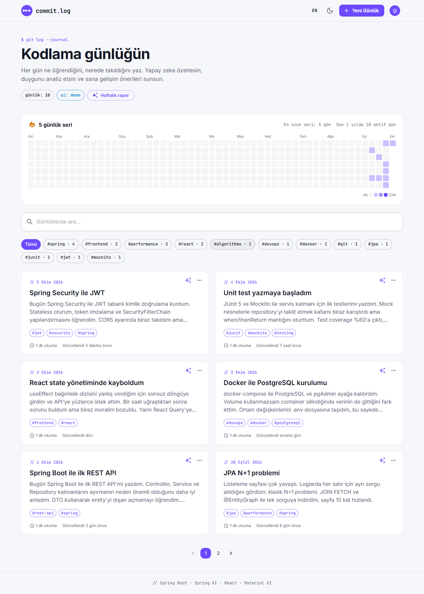
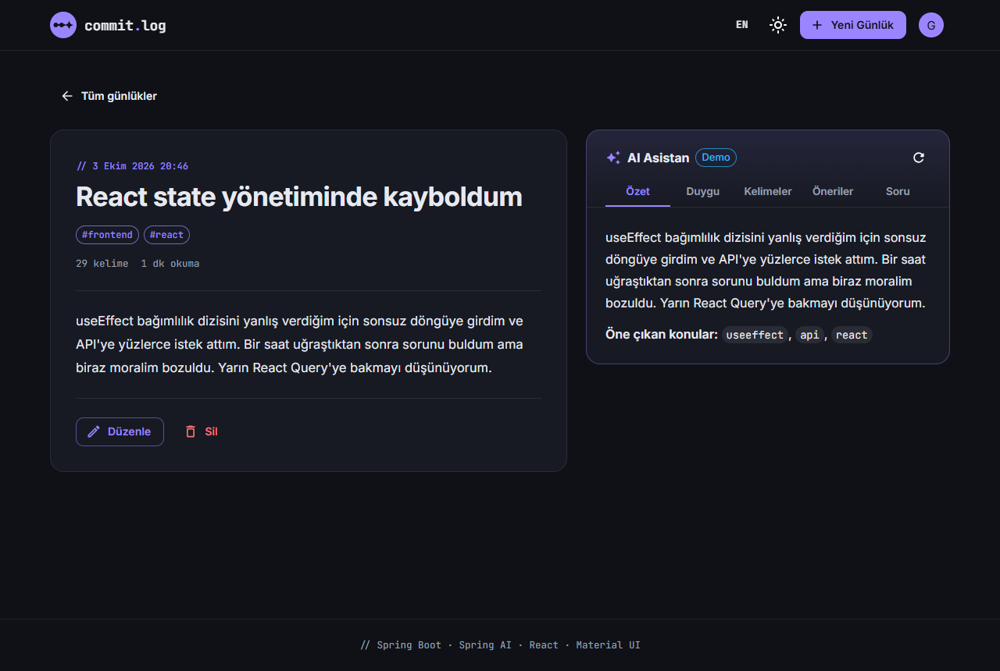
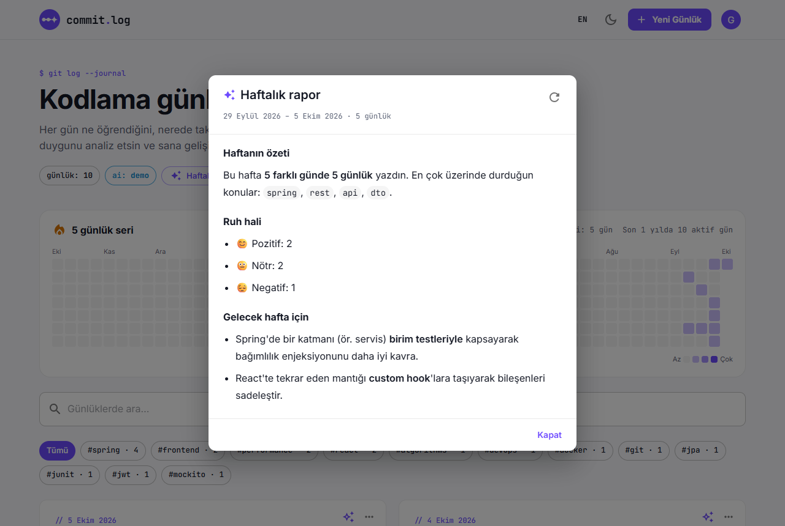
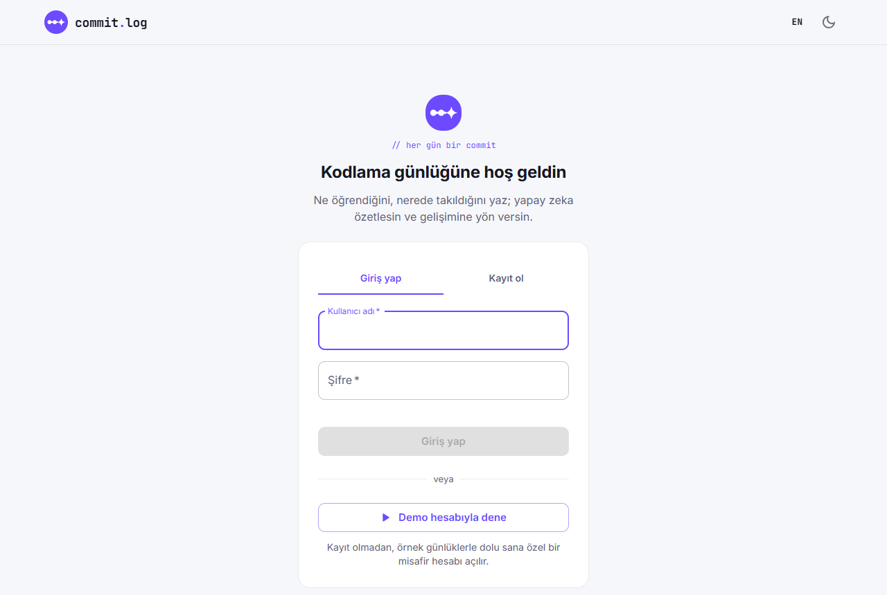
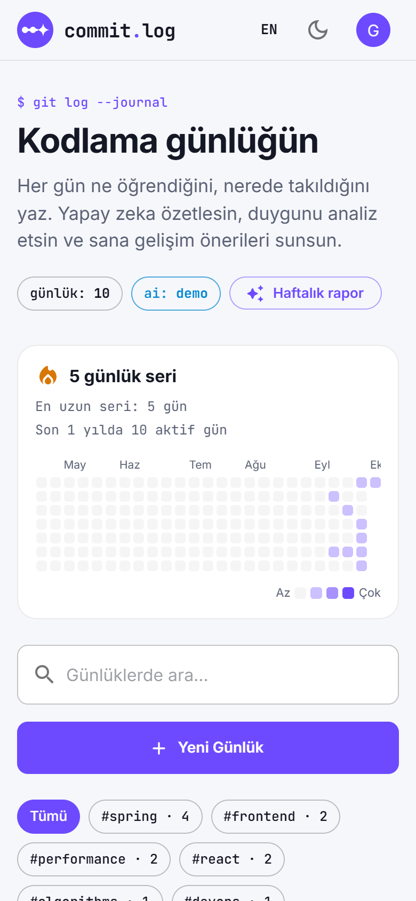

<p align="center">
  
</p>

<h1 align="center">commit.log</h1>

<p align="center"><i>// her gün bir commit — yazılımcılar için AI destekli günlük</i></p>

<p align="center"><b>Türkçe</b> · <a href="README.en.md">English</a></p>

<p align="center">
  <a href="https://github.com/simsekbeyda/commit-log/actions/workflows/ci.yml"></a>
  
  
  
  
</p>

Yazılımcılar için **yapay zeka destekli günlük uygulaması**. Gün içinde ne öğrendiğini, nerede takıldığını yazarsın; uygulama günlüğü özetler, ruh halini analiz eder, anahtar kelimeleri çıkarır, gelişim önerileri sunar, sorularını yanıtlar ve her hafta sana bir değerlendirme raporu hazırlar. GitHub tarzı aktivite ısı haritası ve seri sayacıyla her gün yazmaya teşvik eder.

<p align="center">
  
</p>

<table>
  <tr>
    <td></td>
    <td></td>
  </tr>
  <tr>
    <td></td>
    <td align="center"></td>
  </tr>
</table>

## Hemen dene

Giriş ekranındaki **"Demo hesabıyla dene"** butonu, kayıt olmadan sana özel ve örnek günlüklerle dolu bir misafir hesabı açar. OpenAI anahtarı gerekmez: anahtar yoksa AI özellikleri yerleşik **demo modu** ile çalışır.

```bash
docker compose up --build      # http://localhost:3000
```

## Özellikler

**Günlük**
- Oluşturma, düzenleme, soft delete; başlık/içerikte arama ve sunucu taraflı sayfalama
- **Etiketler**: `#spring`, `#react` gibi etiketler, etikete göre filtreleme, etiket önerileri
- **Aktivite ısı haritası** (son 1 yıl) ve **seri sayacı** (🔥 güncel / en uzun seri)

**AI asistanı** (Spring AI + OpenAI)
- Özet, duygu analizi, anahtar kelimeler, gelişim önerileri ve günlük üzerine soru-cevap
- **Haftalık rapor**: son 7 günün öğrendikleri, zorlandığı noktalar ve gelecek hafta için odak alanları
- Anahtar kelimeleri tek tıkla etikete dönüştürme
- Tüm prompt'lar tek yerde ([AiPrompts.java](code-diary/src/main/java/com/codediary/services/AiPrompts.java)): system/user ayrımı, `<journal>` etiketleriyle **prompt injection** koruması, duygu ve anahtar kelimeler için **yapılandırılmış JSON çıktı**
- Sonuçlar **Caffeine** ile önbelleğe alınır (günlük düzenlenince otomatik geçersiz olur) — aynı analiz için tekrar ücret ödenmez
- **Demo modu**: anahtar yoksa kural tabanlı bir motor (Türkçe ek analizi, teknik terim sözlüğü) aynı uç noktaları yanıtlar

**Güvenlik ve altyapı**
- **Spring Security + JWT** (OAuth2 Resource Server, HS256), BCrypt; her kullanıcı yalnızca kendi günlüklerini görür
- Türkçe/İngilizce arayüz ve API mesajları (`Accept-Language`), açık/koyu tema, responsive tasarım
- H2 (geliştirme) / **PostgreSQL** (Docker) profilleri, çok aşamalı Dockerfile'lar, **GitHub Actions** CI
- Bean Validation + `@RestControllerAdvice` ile tutarlı JSON hata gövdeleri, Swagger UI

## Teknik kararlar

- **Durumsuz JWT kimlik doğrulaması.** Frontend ve backend ayrı uygulamalar olduğu için sunucu tarafında oturum tutmak yerine imzalı token kullanıldı. Ek bir JWT kütüphanesi yerine Spring Security'nin kendi OAuth2 Resource Server desteği (Nimbus, HS256) tercih edildi.
- **Kullanıcı izolasyonu veri katmanında.** Her repository sorgusu günlüğün sahibine göre filtrelenir. Başka bir kullanıcının günlüğü istendiğinde 403 yerine 404 döner, böylece kaydın var olup olmadığı bile sızdırılmaz.
- **Prompt injection'a karşı katmanlı önlem.** Kurallar *system* mesajında, kullanıcı içeriği *user* mesajında `<journal>` etiketleri arasında gider ve model bu içeriğin talimat değil veri olduğu konusunda uyarılır. Kapanış etiketi kaçışlanır; mesajlar şablon olarak işlenmediği için içerikteki `{ }` karakterleri de sorun çıkarmaz.
- **Serbest metin ayrıştırma yerine yapılandırılmış çıktı.** Duygu analizi ve anahtar kelimeler OpenAI'ın JSON modu ile istenir ve doğrudan Java record'larına dönüştürülür. Model biçimi bozduğunda kırılan metin ayrıştırma kodu ortadan kalktı.
- **Kendiliğinden geçersizleşen önbellek.** AI sonuçlarının önbellek anahtarı *günlük + son güncelleme zamanı + dil + mod* bilgisinden oluşur. Günlük düzenlenince anahtar değiştiği için ayrıca önbellek temizleme kodu gerekmez. Caffeine'de boyut ve süre sınırı vardır.
- **Maliyetsiz demo.** OpenAI anahtarı yokken aynı uç noktaları kural tabanlı bir motor yanıtlar. Her ziyaretçiye ayrı bir misafir hesabı açıldığı için kimse başkasının verisini göremez veya bozamaz.
- **Gerçek HTTP ile AI testi.** Testler, OpenAI'ı taklit eden yerel bir HTTP sunucusu (JDK `HttpServer`) kullanır. Böylece mock'lanmış bir arayüz yerine uygulamanın gönderdiği gerçek istek doğrulanır: model, mesaj rolleri, JSON modu, temperature ve dil.

## Mimari

```
code-diary/                 Spring Boot backend
├── controller/             REST uç noktaları (Auth, Journals, AI)
├── services/               İş mantığı, AI prompt'ları, demo AI motoru, örnek veri
├── security/               JWT üretimi/doğrulaması, SecurityFilterChain
├── repository/             Spring Data JPA (tüm sorgular kullanıcıya göre filtreli)
├── dto/ model/             İstek/yanıt nesneleri ve JPA entity'leri
├── exception/              Yerelleştirilmiş global hata yönetimi
└── config/                 CORS, OpenAPI, ilk açılış verisi

code-diary-frontend/        React SPA
├── pages/                  Giriş, liste, detay (+AI paneli), form, 404
├── components/             Isı haritası, haftalık rapor, AiPanel, JournalCard…
├── context/                Oturum, tema ve bildirim sağlayıcıları
├── i18n/                   TR/EN çeviriler
└── services/               axios istemcisi ve API çağrıları
```

## Kurulum

### Docker ile (önerilen)

```bash
docker compose up --build
```

PostgreSQL, backend ve frontend birlikte ayağa kalkar. Uygulama http://localhost:3000, Swagger http://localhost:8080/swagger-ui.html adresindedir. Gerçek AI için kök dizinde bir `.env` dosyası oluşturup içine `OPENAI_API_KEY=sk-...` yazın; Docker Compose bu dosyayı otomatik okur (dosya `.gitignore`'da, repoya gitmez).

### Elle

**Gereksinimler:** Java 21+, Node.js 18+

```bash
# Backend — H2 veritabanıyla çalışır
cd code-diary
cp .env.example .env        # OPENAI_API_KEY (isteğe bağlı, yoksa demo modu)
./mvnw spring-boot:run      # Windows: mvnw.cmd spring-boot:run

# Frontend (ikinci bir terminalde, proje kök dizininden)
cd code-diary-frontend
npm install
npm start                   # http://localhost:3000
```

İlk açılışta `demo` / `demo1234` kullanıcısı örnek günlüklerle oluşturulur.

### Testler

```bash
# Proje kök dizininden
cd code-diary && ./mvnw test && cd ..                      # backend: entegrasyon + birim testleri
cd code-diary-frontend && npm test -- --watchAll=false     # frontend: bileşen testleri
```

Backend testleri, OpenAI'ı taklit eden yerel bir HTTP sunucusuyla gönderilen prompt'ları da doğrular (system/user ayrımı, JSON modu, önbellek, dil seçimi) — gerçek bir API anahtarı gerekmez.

## Ortam değişkenleri

| Değişken | Varsayılan | Açıklama |
| --- | --- | --- |
| `OPENAI_API_KEY` | — | OpenAI API anahtarı (yoksa demo modu) |
| `OPENAI_MODEL` | `gpt-4o-mini` | Sohbet modeli |
| `AI_DEMO_MODE` | `true` | Anahtar yokken demo yanıtları (`false` → AI uç noktaları 503) |
| `JWT_SECRET` | geliştirme anahtarı | Token imzalama anahtarı, **üretimde mutlaka değiştirin** (≥32 karakter) |
| `SPRING_PROFILES_ACTIVE` | — | `postgres` → PostgreSQL kullan |
| `DATABASE_URL` / `DATABASE_USERNAME` / `DATABASE_PASSWORD` | yerel PostgreSQL | `postgres` profili için bağlantı bilgileri |
| `CORS_ALLOWED_ORIGINS` | `http://localhost:3000` | Frontend adresi |
| `REACT_APP_API_URL` | `http://localhost:8080` | Frontend'in bağlanacağı backend (derleme zamanında) |

## API özeti

`/api/auth/*` ve `/api/ai/status` dışındaki tüm uç noktalar `Authorization: Bearer <token>` ister.

| Metot | Yol | Açıklama |
| --- | --- | --- |
| `POST` | `/api/auth/register` · `/api/auth/login` | Kayıt / giriş → JWT |
| `POST` | `/api/auth/demo` | Örnek verili misafir hesabı → JWT |
| `GET` | `/api/auth/me` | Oturumdaki kullanıcı |
| `GET` | `/rest/api/journals?page=0&size=6&q=&tag=` | Listele / ara / etikete göre filtrele |
| `GET` `POST` `PUT` `DELETE` | `/rest/api/journals[/{id}]` | Günlük CRUD (silme: soft delete) |
| `GET` | `/rest/api/journals/tags` | Etiketler ve kullanım sayıları |
| `GET` | `/rest/api/journals/activity?days=365` | Isı haritası verisi ve seriler |
| `GET` | `/api/ai/status` | AI modu: `openai` / `demo` / `off` |
| `GET` | `/api/ai/{summary,sentiment,keywords,suggestion}/{id}?refresh=` | AI analizleri (önbellekli) |
| `GET` | `/api/ai/weekly?refresh=` | Haftalık rapor |
| `POST` | `/api/ai/ask/{id}` | Günlük hakkında soru sor |

## Canlı demoya alma

Demo modu sayesinde ücretsiz katmanlarda anahtarsız yayınlanabilir:

1. **Veritabanı + backend (Render):** önce *New → PostgreSQL* ile bir veritabanı, ardından *New → Web Service* ile `code-diary` klasörünü Docker olarak oluşturun. Ortam değişkenleri: `SPRING_PROFILES_ACTIVE=postgres`, `DATABASE_URL=jdbc:postgresql://<host>:5432/<db>`, `DATABASE_USERNAME`, `DATABASE_PASSWORD`, `JWT_SECRET`, `CORS_ALLOWED_ORIGINS=https://<frontend-adresi>`.
2. **Frontend (Vercel/Netlify):** kök dizin `code-diary-frontend`, derleme komutu `npm run build`, çıktı `build`, ortam değişkeni `REACT_APP_API_URL=https://<backend-adresi>`. SPA yönlendirmesi için tüm yolları `index.html`'e yönlendirin.
3. Gerçek AI istenirse backend'e `OPENAI_API_KEY` ekleyin ve OpenAI panelinden **aylık harcama limiti** koyun.

## Lisans

[MIT](LICENSE)
